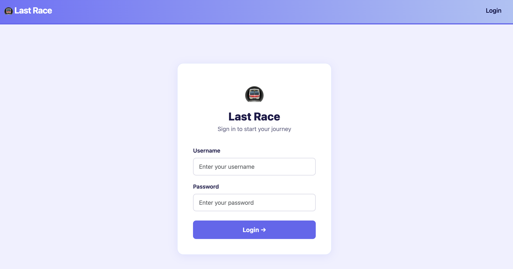
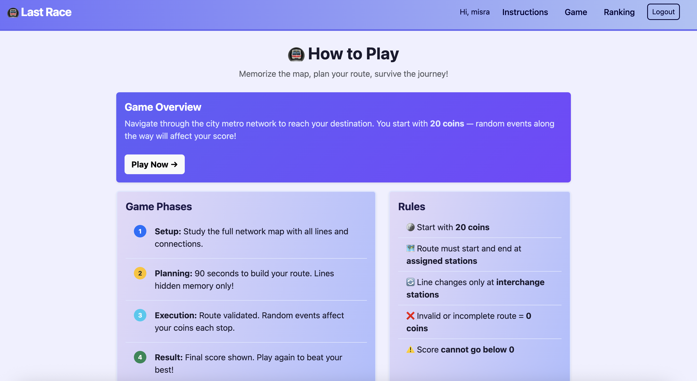
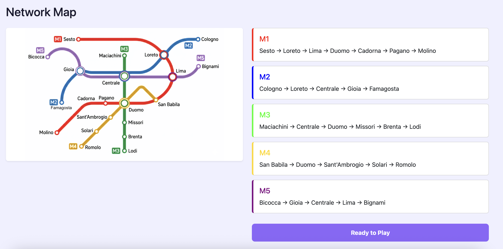
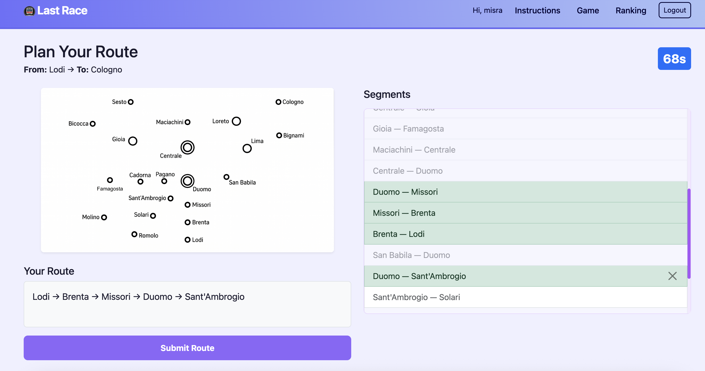
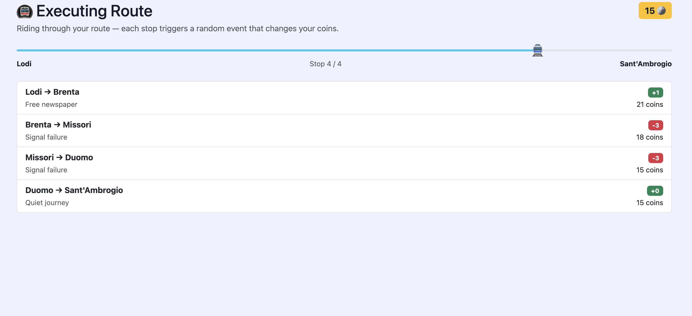
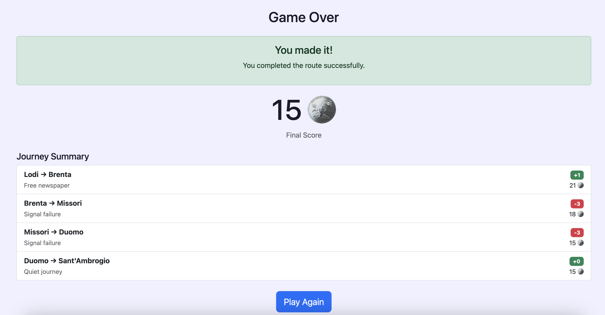
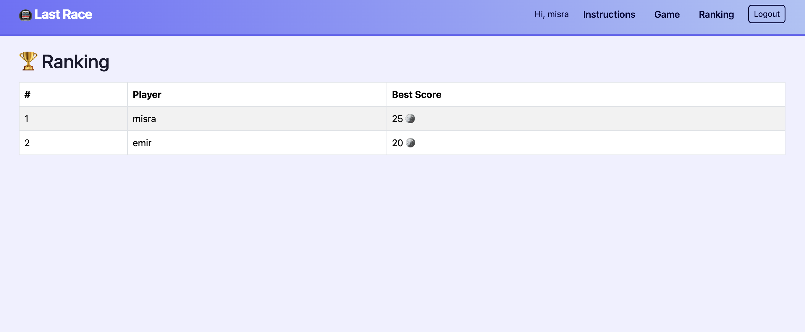

# Exam #1: "Last Race"
## Student: s358966 OZDEMIR MISRA NUR

## React Client Application Routes

- Route `/`: Instructions page. Explains how to play; for logged-in users it also shows a "Play Now" button. The network map is **not** shown to anonymous visitors.
- Route `/login`: Login form (username + password).
- Route `/game`: The game itself, running through its four phases (setup, planning, execution, result). Protected: redirects to `/login` if not authenticated.
- Route `/ranking`: General ranking with the best score of each registered user. Protected: redirects to `/login` if not authenticated.

## API Server

- POST `/api/login`
  - request body: `{ username, password }`
  - response body: `{ id, username }` on success, `401` on wrong credentials.
- POST `/api/logout`
  - no parameters; clears the session.
  - response body: `{ message }`.
- GET `/api/ranking` (auth required)
  - no parameters.
  - response body: array of `{ username, best_score }`, ordered by best score descending.
- GET `/api/games/start` (auth required)
  - no parameters; randomly assigns a start and a destination station (at least 3 segments apart) and stores them in the session.
  - response body: `{ startStation, endStation, stations, lines, segments }` (stations/lines for the map, segments as `{ from, to }` pairs).
- POST `/api/games/validate` (auth required)
  - request body: `{ playerRoute: [{ from, to }, ...] }`. The start/end stations are read from the session, not from the client.
  - response body: `{ valid: false, finalScore: 0 }` if the route is invalid/incomplete, otherwise `{ valid: true, steps: [{ from, to, event, effect, coins }], finalScore }`. The game result is saved server-side.

## Database Tables

- Table `users` - registered users: `id`, `username`, `password` (scrypt hash), `salt`.
- Table `stations` - the metro stations: `id`, `name`.
- Table `lines` - the metro lines: `id`, `name`, `color`.
- Table `line_stations` - which stations belong to which line and in which order: `line_id`, `station_id`, `position`. (Interchange stations are derived from this table.)
- Table `events` - the random events of a segment: `id`, `description`, `effect` (-4..+4).
- Table `games` - one row per played game: `id`, `user_id`, `score`.

## Main React Components

- `App` (in `App.jsx`): defines the routes and wraps everything in the user context and router; `ProtectedRoute` guards the authenticated pages.
- `UserProvider` / `useUser` (in `contexts/UserContext.jsx`): holds the logged-in user state and shares it across the app.
- `AppNavbar` (in `components/Navbar.jsx`): top navigation bar; shows links and logout when logged in.
- `GamePage` (in `pages/GamePage.jsx`): orchestrates the game, fetches a new game and switches between the four phase components.
- `SetupPhase` (in `components/game/SetupPhase.jsx`): shows the full network map with all lines and connections.
- `PlanningPhase` (in `components/game/PlanningPhase.jsx`): station-only map, assigned stations, 90-second timer and the segment list to build the route.
- `ExecutionPhase` (in `components/game/ExecutionPhase.jsx`): validates the route and reveals each step with its random event and the updated coin total.
- `ResultPhase` (in `components/game/ResultPhase.jsx`): shows the final score and a "Play Again" button.
- `LoginPage` / `InstructionsPage` / `RankingPage` (in `pages/`): login form, game instructions, and the ranking table.

## Screenshot

## Users Credentials

- `misra`, password `123` (has played games)
- `emir`, password `456` (has played games)
- `pingu`, password `789`

## Use of AI Tools
During this project, I used Gemini to generate map images and Claude Online Chat as coding assistant. 
I mainly used them to better understand the requirements, break the project into smaller tasks, 
and check whether my implementation followed the expected structure. I generated code snippets for specific tasks
such as API calls, state management, and component structure.
I also used AI to review my code for possible issues, improve my understanding of best practices, 
and guide me while designing algorithms such as route handling and game flow logic. In addition,
I benefited from AI for general frontend improvements, especially in CSS and UI layout decisions.
All suggestions were carefully reviewed, tested, and adapted into my own code, rather than being 
directly copied.